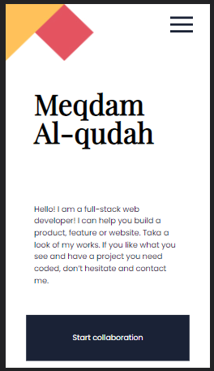
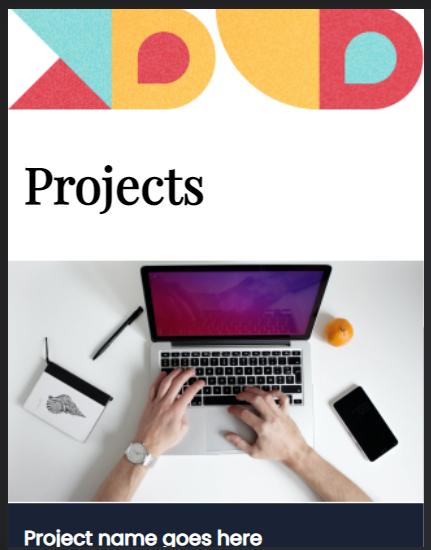
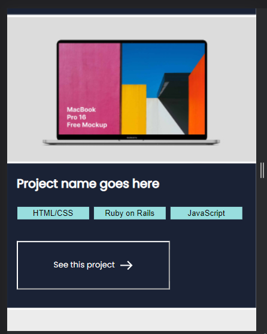
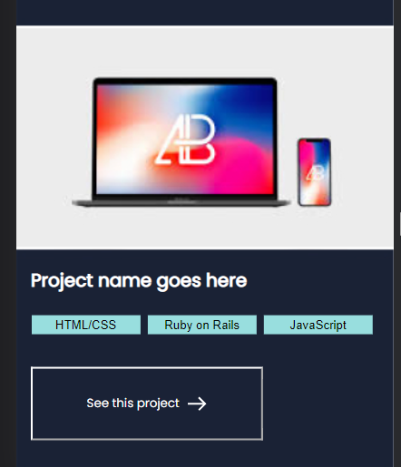
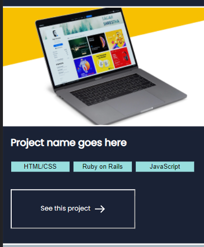
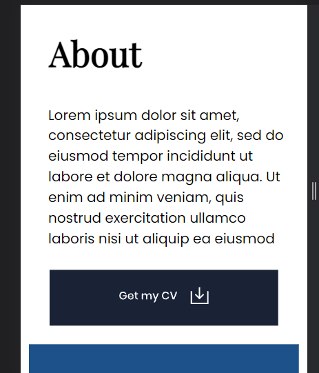
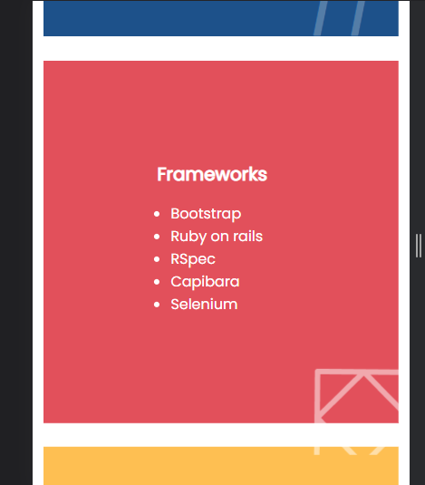
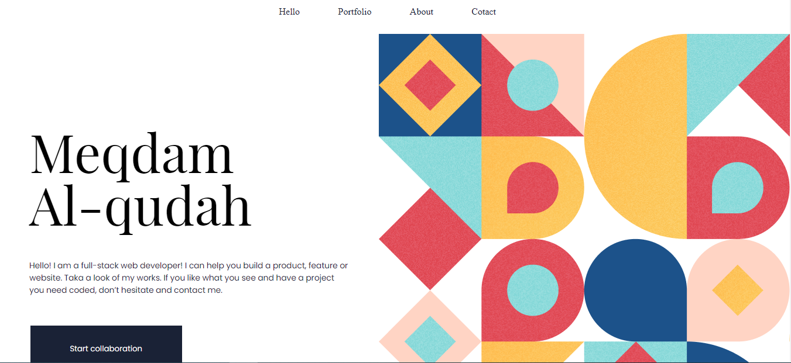
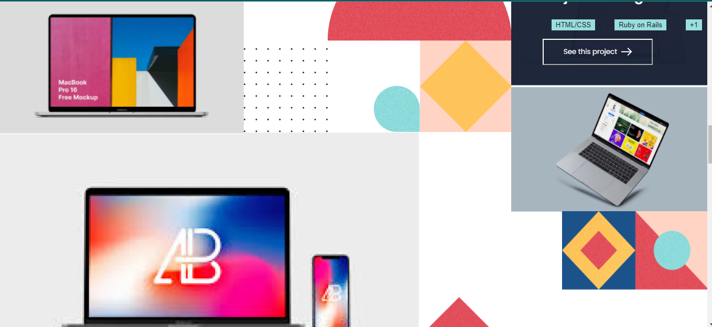

# Project Name

Portfolio setup and mobile version skeleton

# PR

basic design of first section in my portfolio :
1- added html file that contain text's and images.
2- added CSS file to style the HTML File.
3- added linter to the pull request.

The very first siction of the mobile verstion of my portfolio

Work section for portfolio (styling using css and adding to the html)

About me section (styling and adding to the html)

-Desktop Version The header

-Desktop Version the Work Section

## Built With

- Html
- css
- Linter

## Deployed version

https://meqdamalqudah.github.io/Portfolio-setup-and-mobile-version-skeleton/

## Getting Started

-open the index.html file in chrome and see the portfolio

### Setup

-click the code button in the repo and then download the files as a zip file

#### To get a local copy up and running follow these simple example steps.

- Click the green `Code` button on the repo and copy link
- In your local PC, open your terminal in the folder you would like to clone the project.
- Clone the repo with the command: `git clone (copied link)`; like so: `git clone https://github.com/MeqdamAlqudah/Portfolio-setup-and-mobile-version-skeleton.git`
- On the terminal, navigate into the directory like so: `cd Portfolio-setup-and-mobile-version-skeleton`

### Prerequisites

Chrome or any explorer

## Authors

👤 **Meqdam Al-qudah**

- [GitHub](https://github.com/MeqdamAlqudah)
- [Twitter](https://twitter.com/MeqdamQudah)
- [LinkedIn](www.linkedin.com/in/meqdam-al-qudah-7514a21b5)
